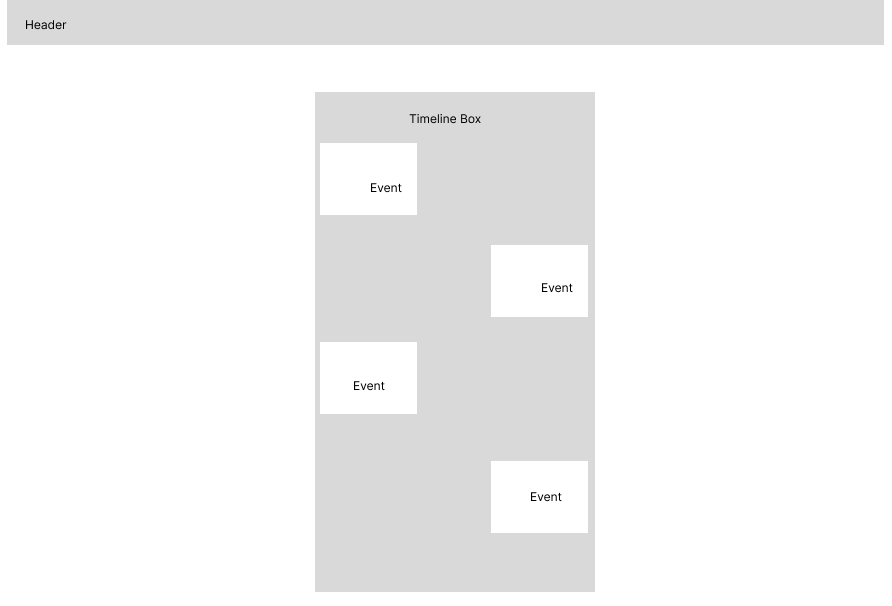
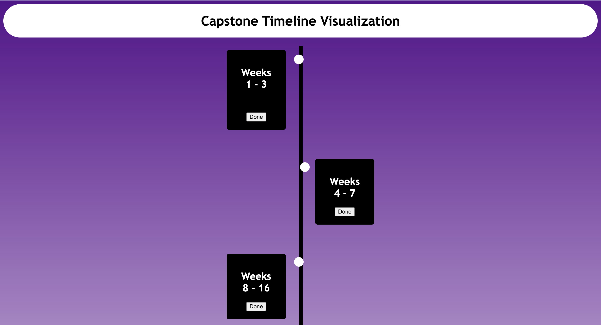
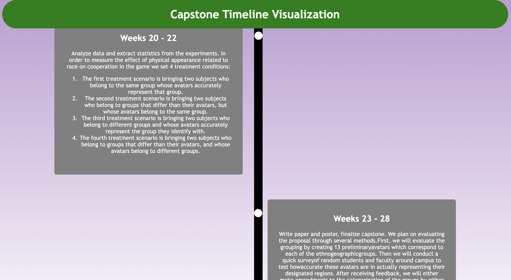

# Assignment 2 - *Capstone Timeline Visualization*

Submitted by: **Yahia Beethoven Tayel**

**Capstone Timeline Visualization** is a simple website that displays the 6 main milestones of my capstone project. At first, only the headlines (week numbers) of these steps are shown until the user hovers over any of them, after which all blocks expand horizontally and the text of the specific milestione on which the mouse was hovered on becomes visible. With each block the user hovers on, the text appears while expanding the box vertically. At the bottom of each milestone, there is a button with the text "Done" that the user can click when they are done reading the steps of the milestone. After clicking, the block changes from black to grey and the button vanishes to indicate this milestone has been completed (similar to the logic of a to-do list). As the user clicks on each button and progresses, if all 6 are clicked, the header changes from white to green and its text from black to white to indicate the capstone project is finally done! 

Here is a link to the webpage: 
https://yahiabeethoven.github.io/ConnectionsLab/Week2/interactiveWebpageAssignment/index.html

## Required Features

The following **required** functionality is completed:

* [x] two event-driven user interactions that are handled in a script.js file (mouse over blocks, clicking of buttons)

## Progress

I designed one main wireframe for this project given its simple nature and direct approach.

For this assignment, I wanted to create a very interactive timeline that takes you from the starting point all the way to the end point. The goal was to indicate to the user that they have "completed" a node after they read it somehow, and to smoothly transition between nodes. This was achieved, although not perfect because I would have liked to also gradually recolor the timeline vertical ruler along with the boxes to show progress, and I wanted to add more fun effects when the user is done going through all milestones such as a funny sound or some fireworks naimation across the screen. I could also ensure progress is saved in the future such that the web page is actually meaningful as a progress indicator. I could have also added some images to each milestone when it is hovered/clicked to elaborate on what exactly happened in that phase as documentation.

Overall, I think the assignment was quite manageable, and had significantly refreshed my memory when it comes to working with JavaScript and further with HTML and CSS, so I'm glad that I got to do this webpage!

## UI Screenshots
How the page looks like initially without any hovering or clicking

How the page looks like after all blocks have been clicked

