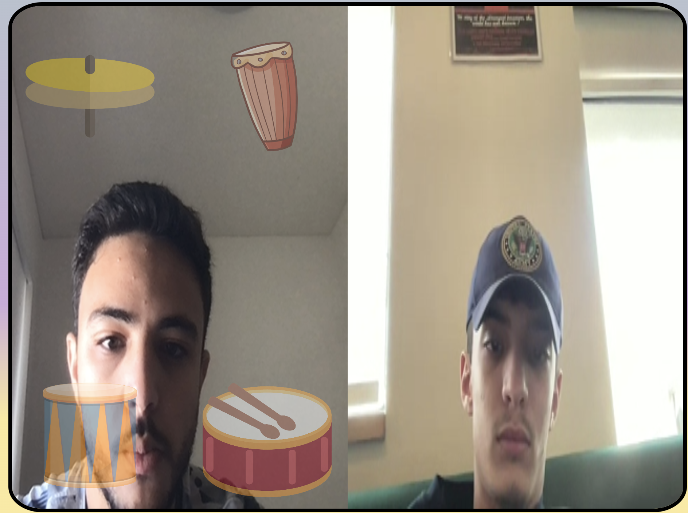

# Body-Beat: a Connection Lab project
### Youssef Aouni & Yahia Beethoven    

## Link to Project: https://glitch.com/edit/#!/body-beat

## Concept:
Body beat is a unique web application that allows users to collaborate and create music by utilizing their bodies.
Through the utilization of motion-tracking technology, users can play various instruments by making specific body movements. This allows for a truly 
interactive experience that allows two people to create music together without having to be in the same physical space. Our team believes that it is 
hay time to rethink the way people connect online and rethink the way we interact and connect online from a new perspective. Body-beat is an attempt
to encourage people to connect in a unique and fun way that includes physical movement, making art and unleashing their creativity. the platform has 
been designed to be user-friendly and intuitive. It featuring a basic user interface with a video feed that connects two users, as well as a set of
instruments that each user can choose from that can be drums or synth sounds. Through the use of motion tracking and a camera, the platform can detect 
the movements of each user and interpret them as notes on the corresponding instrument. This allows the two users to create music together in real-time or add sounds to famous songs,regardless of distance.
## Design:
Body-Beat is especially engineered to have a straightforward and intuitive design in order to provide the users with a frictionless interaction with the website. Moreover, the pastel color palette, use of emojis, and big clear buttons, have been purposely implemented to appeal to the younger generations as much as the older generation. Body-Beat aims to be an attractive website that would appeal to all age ranges, that can be seamlessly used by everyone.
Once the users are in a room they have the option of choosing the instruments they would like to play with their wrists( drums or synths). Moreover, the users have the choice of playing a background song from four different categories (Rock, Wavey, house, silly) that they can edit creatively by adding on sounds on their own.
## Tools:
Body-Beat required a lot of different tools and techniques inorder to perfect all the features. here is the list of the tools we used:
- PoseNet, ml5 library has been used to detect the users body movement and predict the position of the arms and the wrists.
- P5 Live Media, developed and made available by the ITP in New York University, allowed us to run your signaling server by running server.js (with       Node, Express and Socket.io). This tool has allowed us to share direct video and data feed from users.
- P5, we used p5 as it was able to run the ml5 library and P5 live media and thus all the web-app had been developed through P5.
- Glitch, allowed us to host our website.
## Technical Difficulties:
- Building the project was challenging at first because ml5 and PoseNet require very specific parameters to be accurate and detect motion accurately with the video captured. After many trial and error, we were able to obtain the perfect measurements and correct parameters to bets utilize these libraries.
- Working with sockets was quite difficult, we actually did not use the traditional Socket.io functionalities but rather the SimplePeer functionalities. Also, the newest versions of Socket.io, node, and others were not necessarily easy to work with, so we standardized some versions for each that we were more familiar with
- Synchronizing changes such as the sounds played and background music was a big challenge as well. Rather than transmit sound through the microphone back and forth for the instrument sound, we figured that would be too chaotic and the sound quality is much worse than if pre-recorded and played on-demand. For that, all the sounds played are done so locally after receiving signals from the server. Similarly we applied the same logic to background music. However, not only could you hear the sounds synchronously, but a user can turn it off for the other, and the checkbox indicating the choice updates when chosen by the other player to enhance interactivity.

```
    let backgroundButtons = document.querySelectorAll('input[type="checkbox"]');
    for (let i = 0; i < backgroundButtons.length; i++) {
      backgroundButtons[i].addEventListener("change", () => {
        this.TimeToggle(backgroundButtons[i], i);
      });
    }

  }


  modelLoaded() {
    console.log("poseNet ready");
  }
  TimeToggle(el, i) {
    i++;
    let index = i.toString();
    console.log(index);
    if (el.checked) {
      this.backgroundSelected = el.value;
    } else {
      console.log("BACKGROUND MUSIC NOT SELECTED");
      //this.backgroundSelected = "stop1";
      this.backgroundSelected = "stop"+index;
    }
```
- Working with sockets was quite difficult, we actually did not use the traditional Socket.io functionalities but rather the SimplePeer functionalities. Also, the newest versions of Socket.io, node, and others were not necessarily easy to work with, so we standardized some versions for each that we were more familiar with
- We used the P5 LiveMedia library to enhance the multimedia features of the project, but we had to add some helper functions in order to make the client-server connection work smoothly along with all the other libraries we are also using.
A snippet of what we added is included here
```
on(event, callback) {
    if (event == "stream") {
      this.onStream(callback);
    } else if (event == "data") {
      this.onData(callback);
    } else if (event == "disconnect") {
      this.onDisconnect(callback);
    } else if (event == "instrumentList") {
      this.onInstrumentList(callback);
    }
    else if (event == "backgroundMusicList") {
      this.onBackgroundMusicList(callback);
    }
  }

  onDisconnect(callback) {
    this.onDisconnectCallback = callback;
  }

  onStream(callback) {
    this.onStreamCallback = callback;
  }

  onData(callback) {
    this.onDataCallback = callback;
  }
  onInstrumentList(callback) {
    this.onInstrumentListCallback = callback;
  }
  onBackgroundMusicList(callback) {
    this.onBackgroundMusicListCallback = callback;
  }

  callOnDisconnectCallback(id) {
    if (this.onDisconnectCallback) {
      this.onDisconnectCallback(id);
    }
  }
  callOnInstrumentListCallback(data) {
    if (this.onInstrumentListCallback) {
      this.onInstrumentListCallback(data);
    }
  }
  callOnBackgroundMusicListCallback(data) {
    if (this.onBackgroundMusicListCallback) {
      this.onBackgroundMusicListCallback(data);
    }
  }

```
- Being able to play different instruments for each type of player required a lot of logical development, which required us to divide the code upon different classes in separate js files. A prime exmaple of such class that we reused for each type of player is the Instrument class that is repsonsible for the UI of touching instruments and seeing visual effects of that.

```
class Instrument {
  constructor(x, y, dx, dy, img, minThresh, maxThresh) {
    this.x = x;
    this.y = y;
    this.radiusX = dx;
    this.radiusY = dy;
    this.img = img;
    this.position = [];
    this.minThresh = minThresh;
    this.maxThresh = maxThresh;
  }
  // Getter
  get coordinates() {
    return this.calcPosition();
  }
  
  get size() {
    return (this.radiusX + this.radiusY)/2;
  }
  
  get maxSize() {
    return this.maxThresh;
  }
  
  get minSize() {
    return this.minThresh;
  }
  
  wristTouch(rightX, rightY,leftX, leftY, wristRadius) {
    let rightTouch = 0;
    let leftTouch = 0;
    if (this.distanceTo(rightX,rightY) <= (this.radiusX + this.radiusY)/2 - 2*wristRadius) {
      rightTouch = 1;
    }
    if (this.distanceTo(leftX, leftY) <= (this.radiusX + this.radiusY)/2 - 2*wristRadius) {
      leftTouch = 1;
    }
    let wristTouches = [rightTouch, leftTouch];
    return wristTouches;
  }
  
  increaseRadius(increment) {
    this.radiusX += increment;  
    this.radiusY += increment;
    // this.display();
  }
  
  shrinkRadius(increment) {
    this.radiusX -= increment;
    this.radiusY -= increment;
    // this.display();
  }
  
  calcPosition() {
    this.position = [this.x,this.y];
    return this.position;
  }
  
  distanceTo(targetX, targetY) {
    return dist(targetX,targetY, this.x, this.y);
  }
  
  display () {
    image(this.img, this.x - this.radiusX/2, this.y - this.radiusY/2, this.radiusX, this.radiusY);
  }
  
  
}
```
### Styling video feed: 
despite being able to share video feed from the users, styling the video window was a challenge as it was displayed in a peculiar 
way and was challenging to re-style. However, we were able to have the two video feeds share a required square in the middle of the page.

### Sharing-Data: 
In order to have a seamless user experience the sound of the instruments needed to be produced upon contact of the wrist's coordinates with the instrument on the screen. Therefore, it was necessary to implement a system that would share with the other user the signals that would generate  the sounds activated. Using the Sharing Data function in P5 Livemedia we were able to share the required data. 
### background music:
One of the biggest challenges was implementing a system that allows the users to play background music. This feature had a lot of hidden challenges because it needs to allow the users to play a song and have it broadcasted to the other user then stopped once they decide to stop it. This issue has made implementing the feature challenging since the music needs to be coordinated and the second user needs to be aware of which song is playing.
### recording the sounds:
In order to make the web application more engaging and interesting the sounds of the instruments need to seem professional and appealing. However, due to the shortage of available special sound effects online we had to improvise. We manually recorded and edited all the sound effects from different sources and added them to our product. Thus, we were able to provide high end, interesting sounds.

## Future-aspirations:
We would like to further develop body-beat in the future. We would like to add more instruments such as guitar or piano and background more songs. We would also like to add some AR features to the web-app. By using poseNet, body detection software we will be able to add elements to the video feed, e.i: the users can choose a hat or an outfit that will be appropriately overlayed over the users body on the screen. 
We are also thinking of adding tone.js which will allow users to be more creative and add more detailed sounds on instruments such as piano or flute.


