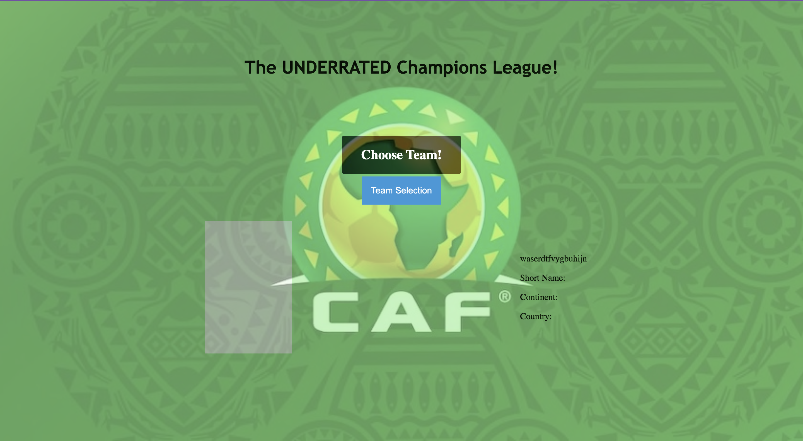
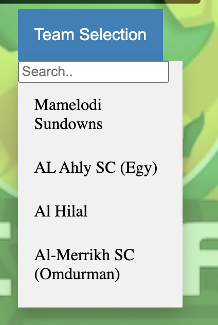
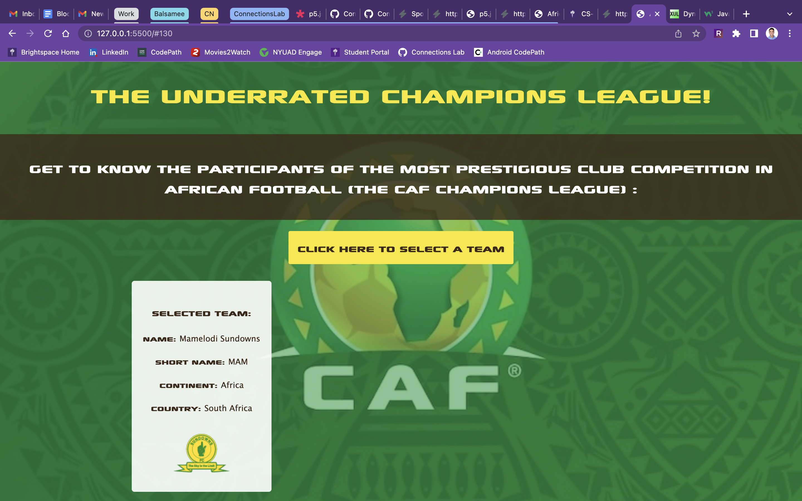
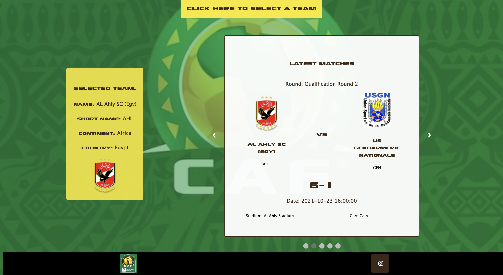
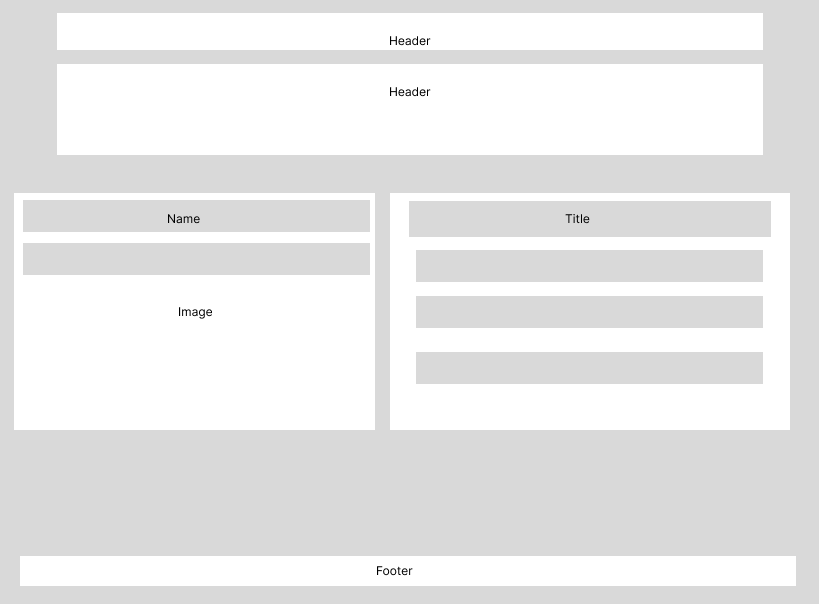

# Project 1 - *African Football Awareness*

Submitted by: **Yahia Beethoven Tayel**

**African Football Awareness** is an interactive website that allows users to explore the teams participating in the Confederation of African Football (CAF)'s most prestigious club competition: the CAF Champions League in order to spread awareness about the underrated African football and cater to potential football fans.

Here is a link to the webpage: 
https://yahiabeethoven.github.io/ConnectionsLab/project1/

Link to the GitHub Repository: 
https://github.com/yahiabeethoven/ConnectionsLab/project1/

## Required Features

The following **required** functionality is completed:

* [x] Data represented successfully
* [x] At least a .html file, a .css file and a .js file
* [x] At least one user interaction
* [x] Utilizes a data set

## Motivation
I chose to build this project for several reasons. First, I am an avid football fan and I love watching games of multiple teams such as Al Ahly SC, FC Barcelona, and the French national team. Furthermore, designing a page that revolves around football and its statistics is very enjoyable for me. This specific topic has become relevant recently because national African leagues have become more significant globally and there has been a noticable surge in African players joining top European teams in England, Spain, and Italy. Therefore, both European and non-European fans alike would be interested in getting to know more about African football and how these African superstars came to be by exploring their beginnings. The words "Champions League" and "football" are recognizable by most, so I used them throughout the websote to help resonate with the audience.

## Process
For this project, I used the <a href="https://app.sportdataapi.com/">Sport Data API</a> to import the dataset containing all information related to football in Africa and the world. I first explored the API and what it can provide by printing out different objects within the JSON files that I called. I then decided on choosing African teams rather than European ones for the purpose of awareness, and tested which attributes can be accessed and how. I based my website design off of the CAF brand as shown, where I used the same color palette and font throughout the page. At first, I created a map mannually containing all team members and their IDs, but for optimization purposes and to allow the website to work if I chose a different season or tournament, I made all information based on fetch calls to the API. I also decided to not include too much information on the page so as to not overwhelm non-football fans and turn them off, and to make the web page load fast enough. Being able to display all the attributes that mattered to me without causing any errors or logical mistakes required me to account for countless edge cases and scenarios, especially given that the API was not complete in many parts. 

## Progress
I went through several stages of progress for this project until reaching what I have now. First, I attempted to display information about African national teams participating in the 32-team African Cup of Nations because it would be representative of each country and induce a sense of patriotism. I was able to do so initially by printing the names and abbreviations of these countries to the page. But when I came to advance the website by including more attributes such as the team logo, the history of that team and latest matches, and any other data, it was impossible because the country IDs in the tournament are different from the team IDs of any team participating in a given tournament, so accessing other data was not an option. I had to then change what I was doing while keeping the end goal similar, so I went ahead and displayed information for African clubs rather than national teams, and changed tournament to CAF Champions League instead of the African Cup of Nations. By doing so, I was able to access a lot more information per team when searching for it by ID. However, when attempting to fetch latest matches, I couldn’t just get them using team ID, I had to fetch the whole list of matches of a given season of the tournament for all teams within a certain period of time, and then check whether the team ID matches that of either home or away team, and then fetch the respective attributes of that match. This process involved more API calls and slowed the loading time a bit, but worked well. I decided to only fetch the 5 most recent matches for the sake of loading time and to not overwhelm the user with too many pieces of information, especially non-football fans.

This was how the page looked like before any styling of any kind, before making the data of a team printed, before adding a subheading, and before adding most of the features.
I then added a dropdown.

This was how the initial dropdown looked like before I styled it and made the search bar work properly; it used to disappear teh moment the user clicks anywhere.
After many edits and styling, this is how the page looked like without the slideshow of latest matches.

Most of the styling and features are completed with the exception of the footer, page icon, and the slideshow.
After adding links to CAF Homepage and CAF Instagram page in the footer, a football icon as Favicon, and a slideshow of the 5 most recent matches of the particular team, this is how the final website looks like (under the subheading).

## Wireframes
I had one main wireframe for this project and I managed to stick to it until the end because of its simplicity and sufficiency in demonstrating teh necessary data to the intended audience.

## Challenges
## Code Snippets
## Next Steps

